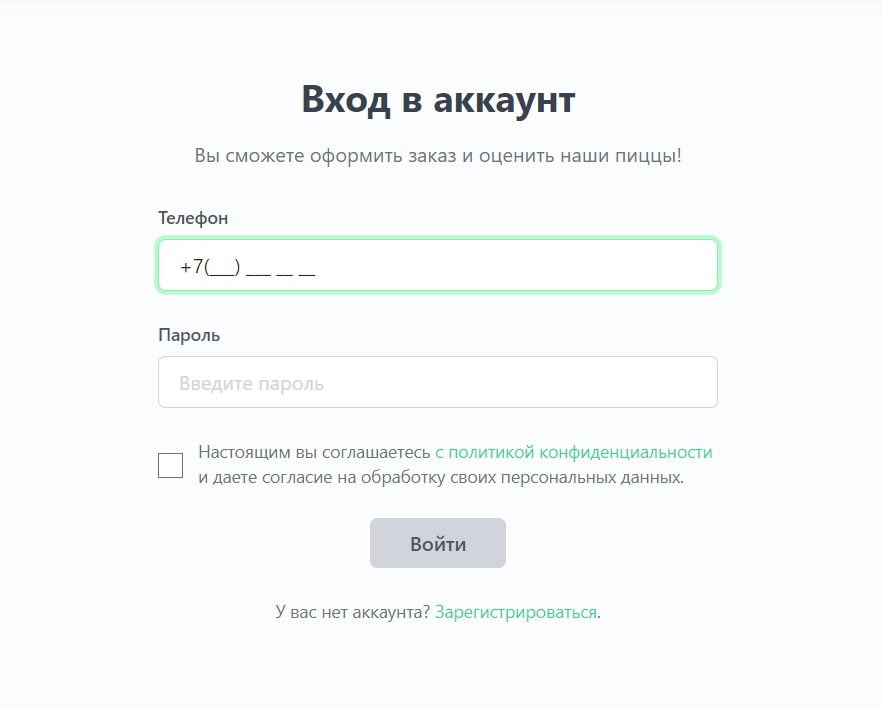
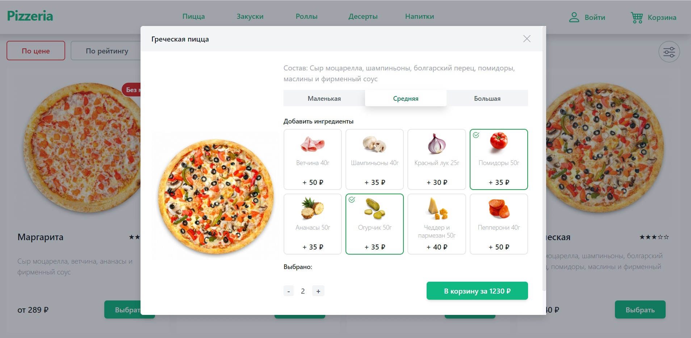
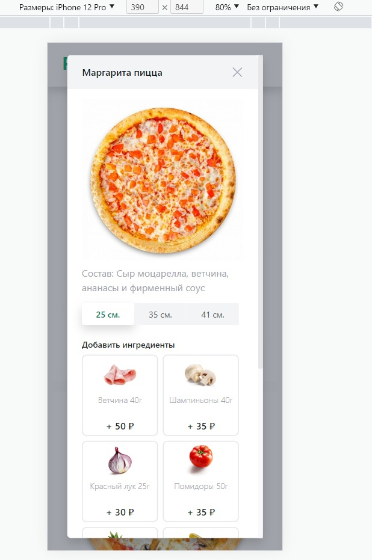
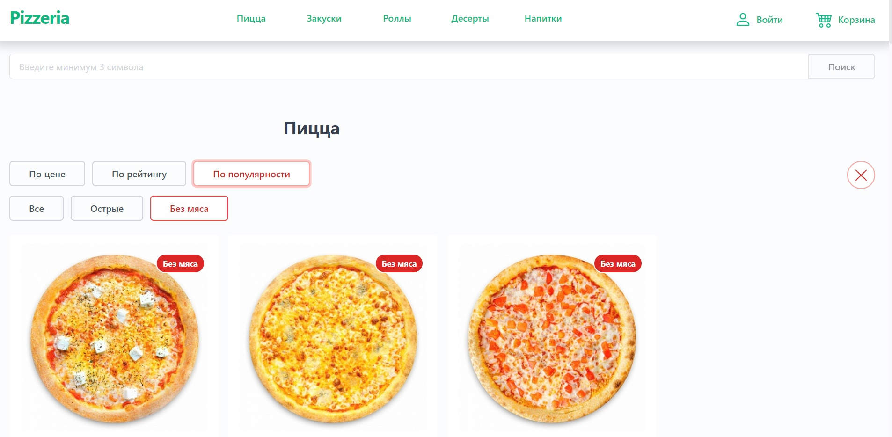
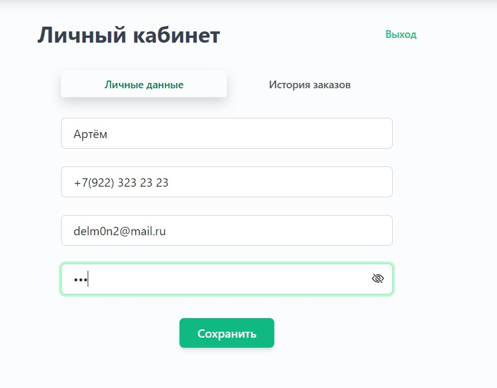
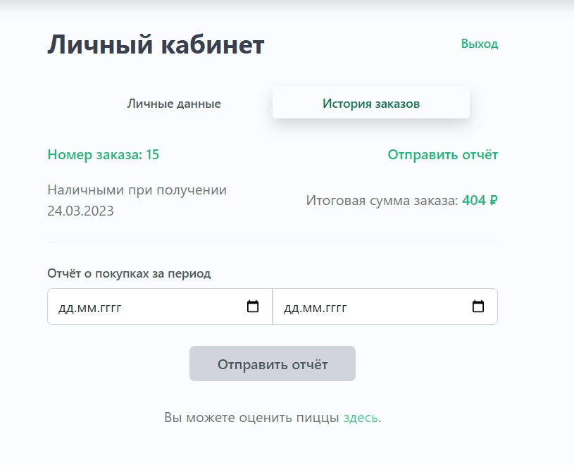

# Курсовая работа

Разработка клиент-серверного веб-приложения онлайн покупки пиццы с использованием фреймворка Angular и языка C#, Entity Framework, PostrgeSQL, NancyFX

    

    

    

    

    

    

    

    

