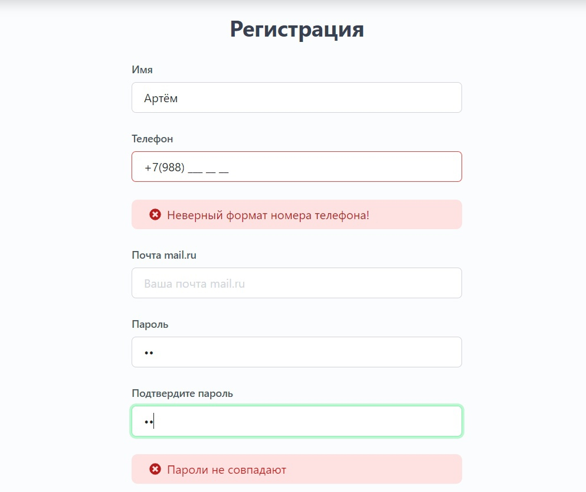
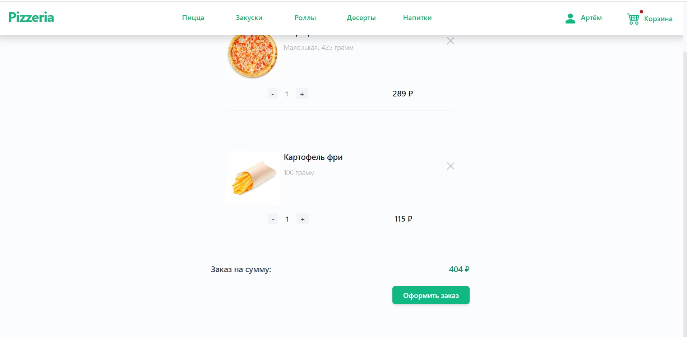

# Курсовая работа 2022

Разработка клиент-серверного веб-приложения онлайн покупки пиццы с использованием фреймворка Angular и языка C#, Entity Framework, PostrgeSQL, NancyFX

 

    

 

    

 

    

 

    

 

    

 

    

 

    

 

    

 
